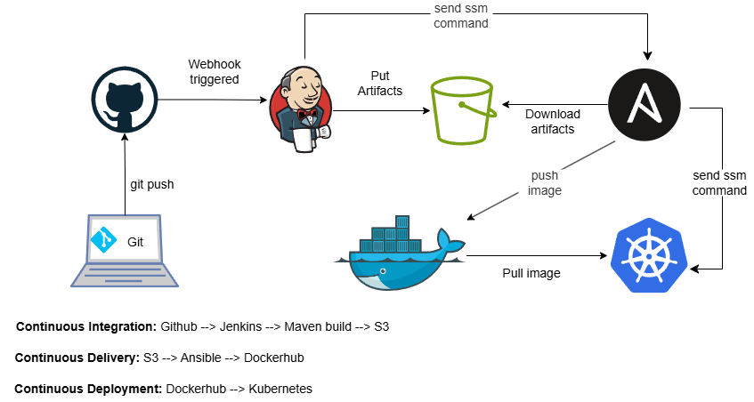

# A production-friendly DevOps Project

This project walks you through the process of constructing a DevOps CI/CD pipeline that can serve a production workload. It follows a microservice architecture where a JAVA web application is packaged as a Docker image with an embedded Tomcat server. This containerized image is deployed and managed as pods in a kubernetes cluster. IaC (with Terraform) and a lot of automation is used making the project truly reproducable. 
The DevOps pipeline is realised by using:

* git
* Jenkins
* Maven
* Ansible
* Docker
* Kubernetes

## Plugins used in the setup
* Jenkins Configuration as Code (JCasC)
* Jenkins Plugins Manager
* Session Manager Plugin
The rest are listed in the plugins.txt file

The workflow is illustrated in the diagram below.

## The terraform configuration provisions the following resources

A VPC

Availability Zones

Internet gateway

NAT Gateway or NAT instance

Two public subnets in two availability zones

Two private subnets in two availability zones

Route tables

Security groups

IAM roles

ec2 instance profiles with ec2 roles

secrets manager secrets

VPC endpoints

random password

aws_ssm_document

Openid Connect Provider

Ec2 instances

S3 buckets

Load balancer

Target/Autoscaling groups

kms key and policy

## Steps to reproduce this project

### Prereqisites
* Create two **private** github repos Y and X. Y has the web application and the X is for managing the jekins server. The repo X contains jenkins.yml, plugins.txt and .github. The repo Y contains pom.xml, Jenkinsfile, src/main, jenkins/job.

* Setup a github webhook for the Y repo thus:

1. Payload URL: http://{Load-Balancer-DNS}/github-webhook/
2. Content type: application/json
3. SSL verification: Disable
4. Which events would you like to trigger this webhook? Just the push event.
5. Tick Active at the end then take save.

* Setup a private deploy key used by Jenkins EC2 to access web project GitHub Y repo thus:

1. Generate an SSH key pair with ssh-keygen -t ed25519 -C webapp-repo-key
2. Go to github deploy keys and add the public ssh key
3. Add a title and and click add key
4. Now open the terraform config and paste the private ssh key to /modules/secrets_manager/id_rsa 

* Setup a fine-grained access token to be used for authentication when a webhook is triggered:  

1. Go to fine-grained token in github and click generate a new token
2. Povide a token name, description, resource owner and choose "only selected repositories" under  
   repository access and select the Y repo.
3. Add these permission:
     Read access to metadata
     Read and Write access to code and repository hooks
4. Click generate and copy the token, then open /modules/secrets_manager/webhookpat and paste it

* Setup a fine-grained token for authentication to X github repo by Jenkins when downloading plugins file

1. Follow step 1 above 
2. Choose "only selected repositories" under  repository access and select the X repo.
3. Add these permission:
     Read access to metadata
     Read access to code
4.  Click generate and copy the token, then open /modules/secrets_manager/jenkins-ec2 and paste it.

* Create a backend S3 bucket to store the terraform state file. The bucket name according terraform.tf file is jenkinsbackend.
* Download the terraform config folder to your local machine.
* Install terraform CLI and configure your CLI with your AWS Account access key.
* Create a dockerhub account.

Follow these steps to realise the project
1. Apply the terraform configuration.
2. Connect to the **ansible-host** via SSM and login to dockerhub as **root user**.
3. Connect to the **k8sBootStrapHost** via SSM. Replace the vpc and subnet IDs in the deployment.yml file
   in /opt on the k8sBootstrapHost with the correct values. 
   Create a cluster with the command:
   
   *eksctl create cluster -f /opt/cluster.yml*
   
   Wait until you see "all EKS cluster resources for "my-eks-cluster" have been created". Then on the security group of nodes you MUST allow all traffic from the security group of the **k8sBootstrapHost**. This is necessary for kubectl commands to work. Login to the AWS console to do that.
4. Edit a comment in the jenkins.yml and commit the change. This will create the seed job in Jenkins.
5. Paste the Load balancer DNS name in the browse. Obtain the Jenkins password from secrets manager and 
   paste it in the password field. Username is admin. Ensure not to install any plugins because by this time plugins from the plugins.txt file have been installed. 
5. Edit a comment in the Webapp project and commit the change. Jenkins will run the job but will fail.  
   You will have to approve the creation of the webapp-pipeline job by going to settings in jenkins.
6. Try step 5 again. See that the webapp-pipline job is created in Jenkins.
7. Try step 5 again. That's it. The Jenkinsfile will execute, building and deploying the web app on 
   kubernetes. 
8. Access this webapp running on the pods in the cluster by using the application load balancer created 
   by the AWS load balancer controller. You can get DNS name for the load balancer by running:
   *kubectl get ingress webapp-ingress* on **k8sBootstrapHost**. After that type:
   {ALB-DNS-NAME}/my-webapp 
   in the browser to access it. Entering {ALB-DNS-NAME} displays the tomcat server hosting the web app.

9. Clean up by first running "*eksctl delete cluster --name my-eks-cluster --region {AWS-REGION}*. The 
   destroy the infrastructure with terraform destroy. Also delete the IAM policy `AWSLoadBalancerControllerIAMPolicy`

## Summary of traffic flow

Client

  ↓  HTTP :80
  
AWS ALB (Ingress)

  ↓  HTTP :80
  
Service (ClusterIP) :80

  ↓
  
Pod IP :8080

  ↓
  
Container listens on :8080